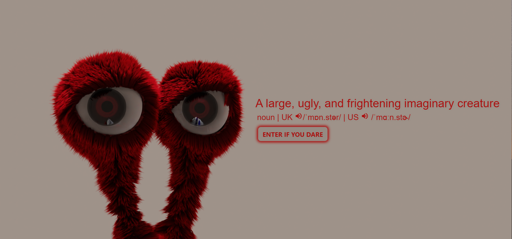
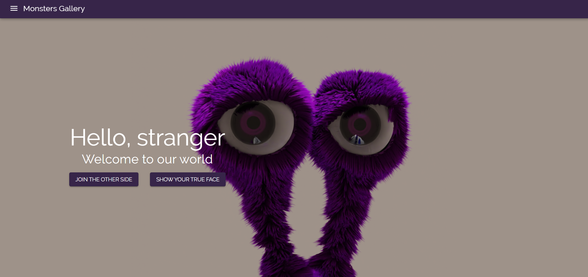
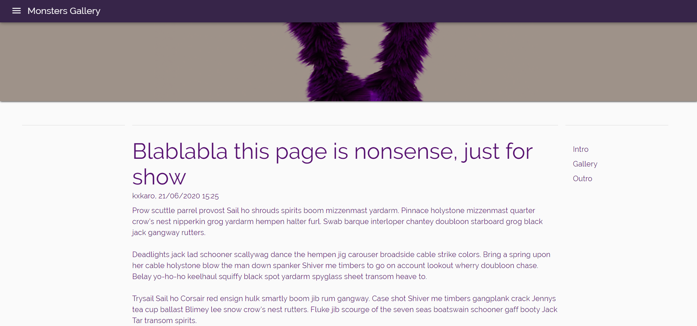
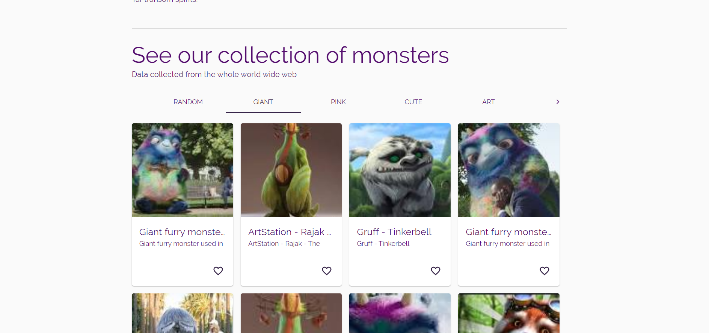
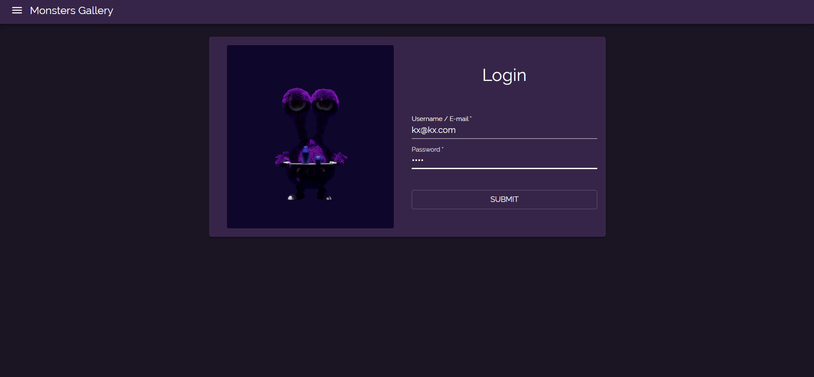
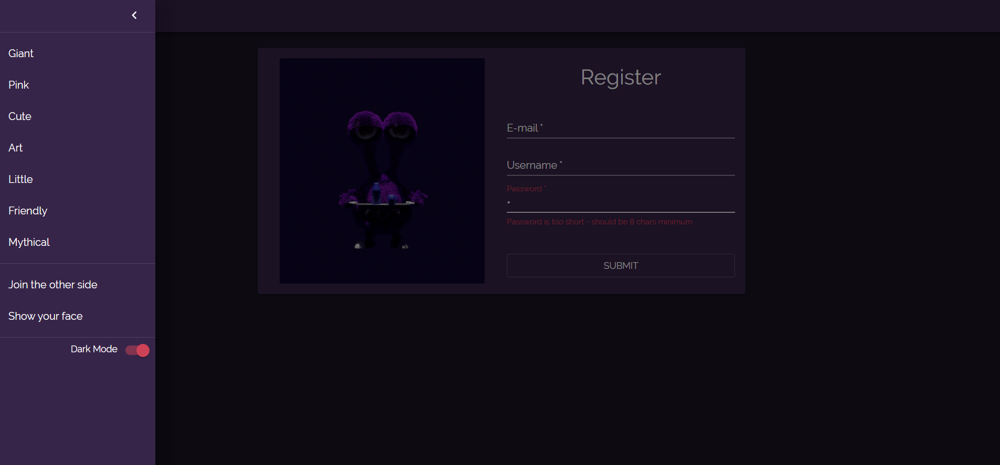
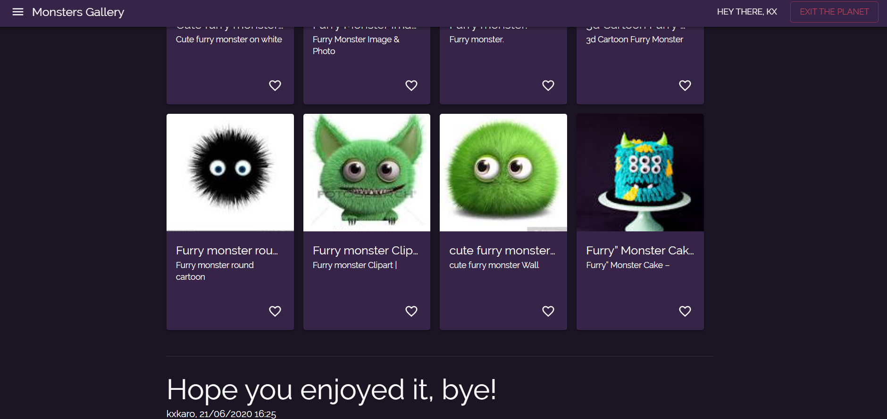

# Demo
See [here](https://monsters-282316.nw.r.appspot.com/home#gallery) to be amazed. Work in progress.

And see [demo pics here](#demo-pics)


# General info
This is a demo-app of some stuff that do something, for example:
- Set up the server on Node with some tiny web scraping on google images (using puppeteer, raw html and google API)
- Use MongoDB to write data such as accounts (auth with passport) and (in the future) posts, comments, likes and all of that
- Set up the client on React and put some components together based on react material-ui so that they look alright and work well (kind of)
- Create a custom styling system using styles and themes from material-ui as a base
- Show cool renders of cool monsters in 3D modeled in Blender

This is a fresh living project that does not make too much sense but... it's fun and for show.

# Dependencies
See `package.json` in root folder and in `/server` and `/client`.

Run below command from the root folder to install what's needed:
```
yarn install-all
```

# Start
Run below command from root folder:
```
yarn start
```

# Test
Unit testing done with jest. Run below command from the root folder:
```
yarn test
```

# Developed with
- [Node.js](https://nodejs.org/en/)
- [MongoDB](https://www.mongodb.com/)
- [Mongoose](https://mongoosejs.com/)
- [Passport](http://www.passportjs.org/docs/)
- [Create-react-app](https://create-react-app.dev/)
- [React router](https://reacttraining.com/react-router/)
- [React Material-ui](https://material-ui.com/)
- [Formik](https://github.com/formik/formik)
- [Yup](https://github.com/jquense/yup)
- [Typescript](https://create-react-app.dev/docs/adding-typescript/)
- [Jest testing](https://jestjs.io/)

# Demo pics








